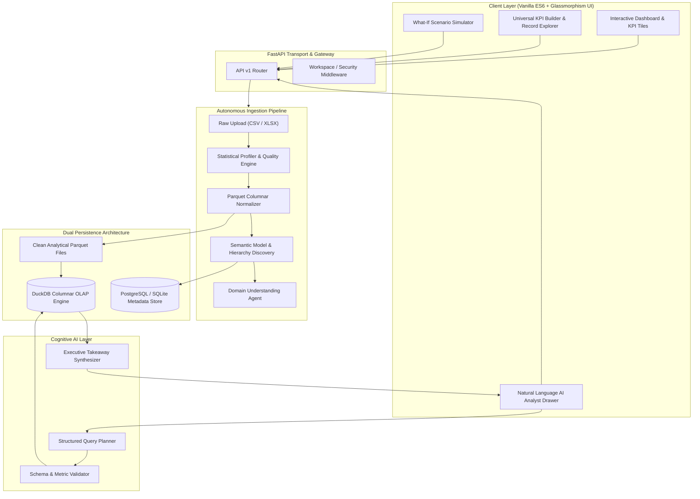

# 📊 MetricMind: Enterprise AI Business Intelligence & Autonomous Analytics Platform

[](https://www.python.org/)
[](https://fastapi.tiangolo.com/)
[](https://duckdb.org/)
[](https://pola.rs/)
[](https://www.postgresql.org/)
[](LICENSE)

**MetricMind** is an enterprise-grade autonomous Business Intelligence (BI) platform engineered to solve the most critical flaw in generative AI analytics: **numerical hallucination**. 

Traditional LLM analytics rely on language models to calculate formulas and sums directly within their prompt context, invariably causing hallucinated numbers, token overflows on large datasets, and non-reproducible answers. MetricMind enforces an uncompromising **dual-layer architecture**:
1. **Deterministic Analytical Core:** DuckDB, Polars, and PostgreSQL execute all mathematical aggregations, business metrics, and statistical profiles with 100% precision.
2. **Cognitive AI Reasoning Layer:** LLM agents analyze schemas, construct validated query plans, and synthesize executive insights solely from verified numerical outputs. **The LLM is never permitted to invent or compute raw numbers.**

---

## 📑 Table of Contents

- [The Core Engineering Problem](#-the-core-engineering-problem)
- [Architecture & System Flow](#-architecture--system-flow)
- [Key Features & Capabilities](#-key-features--capabilities)
  - [1. Five-Stage Automated Ingestion Pipeline](#1-five-stage-automated-ingestion-pipeline)
  - [2. Deterministic OLAP Engine (DuckDB & Polars)](#2-deterministic-olap-engine-duckdb--polars)
  - [3. Universal KPI Builder & Record Explorer](#3-universal-kpi-builder--record-explorer)
  - [4. Agentic AI Data Analyst (Zero-Hallucination)](#4-agentic-ai-data-analyst-zero-hallucination)
  - [5. Predictive Intelligence & What-If Simulations](#5-predictive-intelligence--what-if-simulations)
  - [6. Robust Dataset Lifecycle & Auto-Deduplication](#6-robust-dataset-lifecycle--auto-deduplication)
- [Technology Stack](#-technology-stack)
- [Project Structure](#-project-structure)
- [REST API Reference](#-rest-api-reference)
- [Getting Started](#-getting-started)
  - [Prerequisites](#prerequisites)
  - [Local Installation](#local-installation)
  - [Docker & Docker Compose](#docker--docker-compose)
- [Database Migrations (Alembic)](#-database-migrations-alembic)
- [Automated Testing Suite](#-automated-testing-suite)
- [Performance & Benchmarks](#-performance--benchmarks)
- [License](#-license)

---

## 🎯 The Core Engineering Problem

| Challenge in Traditional AI BI | How MetricMind Solves It |
| :--- | :--- |
| **Numerical Hallucinations** | LLMs are probabilistic text predictors, not calculators. MetricMind delegates **100% of mathematical computation** to a columnar OLAP database (DuckDB). |
| **Context Window Bottlenecks** | Datasets with 100k+ rows exceed LLM prompt limits. MetricMind compresses and queries datasets out-of-core in Parquet format, passing only aggregate fact tables to the model. |
| **Schema Ignorance & Invalid Queries** | LLMs generate invalid SQL referencing nonexistent columns. MetricMind validates every query plan against the verified dataset schema and semantic model before execution. |
| **Vendor Lock-In & Cloud Egress** | Sensitive corporate CSVs are often sent unencrypted to third-party endpoints. MetricMind performs local deterministic profiling and Parquet normalization on-premise/in-container. |

---

## 🏛 Architecture & System Flow



---

## ⚡ Key Features & Capabilities

### 1. Five-Stage Automated Ingestion Pipeline
When a user uploads a business spreadsheet (CSV or Excel), MetricMind executes an end-to-end autonomous ingestion flow without requiring manual configuration:
1. **Validation & Secure Storage:** Validates MIME types, checks size constraints, and streams the raw file to encrypted local/cloud disk storage.
2. **Distribution & Quality Profiling:** Computes column types, distinct values, null percentages, min/max/mean/variance, and automated quality warnings (e.g., missing values, high cardinality).
3. **Parquet Normalization:** Converts raw row-oriented data into highly compressed, columnar Apache Parquet files for vectorized analytical retrieval.
4. **Automated Semantic Modeling:** Detects primary keys, temporal dimensions, numeric measures, and categorical dimensions to construct an interactive semantic layer.
5. **AI Domain Understanding:** Classifies the dataset domain (e.g., E-Commerce, Aviation, Healthcare, HR, SaaS) and auto-generates recommended executive KPIs and business questions.

### 2. Deterministic OLAP Engine (DuckDB & Polars)
- High-speed vectorized aggregations using **DuckDB** directly over compressed Parquet files.
- Sub-second computation of multidimensional group-by queries, cohort filters, and aggregations across 100,000+ records.
- Zero external database latency: queries operate in-process with minimal RAM overhead.

### 3. Universal KPI Builder & Record Explorer
- **Self-Service Metric Creation:** Business users can select any column, choose an aggregation function (`SUM`, `AVG`, `COUNT`, `MIN`, `MAX`, `RATE`), apply conditional thresholds, and pin custom KPIs to their dashboard.
- **Universal Column Search:** Real-time search across every single column in the dataset without database table restructuring.
- **Complete Row Inspector:** Full modal inspector to audit every field and data type for any record.

### 4. Agentic AI Data Analyst (Zero-Hallucination)
- **Natural Language to Analytical Query:** Converts plain English questions (*"Which product category generated the highest margin in Q4?"*) into validated structured execution plans.
- **Schema Grounding & Guardrails:** Query plans are strictly cross-referenced against the dataset's validated semantic dictionary. Non-existent metrics or illegal dimensions are caught and rejected prior to execution.
- **Deterministic Fallback:** If the external LLM provider is unavailable or unconfigured, the system automatically uses algorithmic statistical fallbacks so the user never faces downtime.

### 5. Predictive Intelligence & What-If Simulations
- **Time-Series Forecasting:** Deterministic historical trend line modeling and projection of future business volume.
- **Dynamic Scenario Modeling:** Interactive sliders to simulate price elasticity, marketing spend increases, or conversion rate shifts with real-time recalculated KPI outcomes.

### 6. Robust Dataset Lifecycle & Auto-Deduplication
- **Duplicate Version Pruning:** Automatically detects when a dataset with the same filename is re-uploaded, cleanly pruning older versions and orphaned files to prevent database bloat.
- **One-Click Dataset Deletion:** Integrated delete controls allowing instant permanent deletion of datasets, derived Parquet caches, and metadata with cascading relational integrity.
- **Persistent Active State:** Remembers active dataset selections across page reloads via client-side storage.

---

## 🛠 Technology Stack

### Backend & Core Analytics
- **Language:** Python 3.10+ (Tested up to Python 3.14)
- **Web Framework:** [FastAPI](https://fastapi.tiangolo.com/) (Asynchronous, OpenAPI/Swagger native)
- **OLAP Engine:** [DuckDB](https://duckdb.org/) (Vectorized columnar analytics)
- **DataFrames:** [Polars](https://pola.rs/) & [NumPy](https://numpy.org/)
- **ORM & Database:** [SQLAlchemy 2.0](https://www.sqlalchemy.org/) (Async engine), [Alembic](https://alembic.sqlalchemy.org/) (Database migrations)
- **Relational Databases:** PostgreSQL (Production) / SQLite (Local development & testing)
- **Validation:** [Pydantic v2](https://docs.pydantic.dev/latest/)

### Frontend & UI
- **Design System:** Vanilla CSS3 with custom design tokens, dark glassmorphism palette, and responsive layouts.
- **JavaScript Architecture:** Pure ES6 Modules (No bulky npm build steps or bloated node_modules required).
- **Visualization:** [Chart.js](https://www.chartjs.org/) for high-performance canvas charts and trends.

---

## 📂 Project Structure

```
├── alembic/                      # Database migration versions and environments
│   ├── versions/                 # Version-controlled migration scripts
│   └── env.py                    # Alembic migration engine configuration
├── app/
│   ├── ai/                       # Cognitive layer: Query planner, synthesizer, guardrails
│   ├── analytics/                # Business metrics, geo engine, insights, forecasting
│   ├── api/                      # REST API routing & dependencies
│   │   ├── router.py             # Root API v1 router aggregator
│   │   └── v1/endpoints/         # Modular endpoints: datasets, dashboards, chat, etc.
│   ├── core/                     # Application configuration, storage managers, settings
│   ├── db/                       # SQLAlchemy database engines, session factories, base models
│   ├── ingestion/                # CSV/Excel parsing, statistical profiler, normalizer
│   ├── models/                   # SQLAlchemy ORM models (Datasets, Dashboards, Chat)
│   ├── repositories/             # Database access layer (CRUD abstractions)
│   ├── schemas/                  # Pydantic DTO validation schemas
│   ├── services/                 # Orchestration services for analytical workflows
│   ├── static/                   # Frontend assets: CSS, JS modules, interactive tools
│   └── templates/                # Single-page application HTML templates
├── data/                         # Local upload storage, Parquet caches, SQLite DB
├── tests/                        # Comprehensive automated test suite (21 test suites)
│   ├── conftest.py               # Async HTTP test fixtures & mocking harnesses
│   ├── test_datasets.py          # Ingestion, upload, and deletion tests
│   ├── test_duckdb_engine.py     # Deterministic aggregation tests
│   └── test_kpi_builder.py       # Self-service KPI builder & explorer tests
├── docker-compose.yml            # Multi-container orchestration (FastAPI + PostgreSQL)
├── Dockerfile                    # Multi-stage production container definition
├── requirements.txt              # Production Python dependencies
└── README.md                     # Technical documentation
```

---

## 🔌 REST API Reference

MetricMind exposes an interactive OpenAPI Swagger UI at `http://127.0.0.1:8000/docs`.

| Method | Endpoint | Description |
| :--- | :--- | :--- |
| `POST` | `/api/v1/datasets/upload` | Upload CSV/Excel; triggers 5-stage auto-profiling pipeline. |
| `GET` | `/api/v1/datasets` | List all available datasets (paginated, sorted by date). |
| `GET` | `/api/v1/datasets/{id}` | Retrieve specific dataset metadata, row counts, and status. |
| `DELETE`| `/api/v1/datasets/{id}` | Permanently delete dataset, database records, and disk files. |
| `POST` | `/api/v1/datasets/clear-past` | Purge all historical datasets except the specified active one. |
| `GET` | `/api/v1/datasets/{id}/dashboards/default` | Fetch auto-generated deterministic KPI dashboard. |
| `POST` | `/api/v1/datasets/{id}/dashboards/kpi-builder/compute` | Execute custom dynamic KPI computation via DuckDB. |
| `POST` | `/api/v1/datasets/{id}/chat` | Query the dataset via natural language AI Data Analyst. |
| `GET` | `/api/v1/datasets/{id}/forecast` | Fetch time-series projections and trend analysis. |
| `POST` | `/api/v1/datasets/{id}/scenario` | Run what-if parameter sensitivity simulation. |
| `GET` | `/health` | Application health check and database connection verification. |

---

## 🚀 Getting Started

### Prerequisites
- **Python:** 3.10 or higher
- **PostgreSQL:** Optional for production (SQLite is configured by default for zero-setup local dev)

### Local Installation

1. **Clone the repository:**
   ```bash
   git clone https://github.com/your-username/metricmind.git
   cd metricmind
   ```

2. **Create and activate a virtual environment:**
   ```bash
   # Linux / macOS
   python -m venv .venv
   source .venv/bin/activate

   # Windows
   python -m venv .venv
   .venv\Scripts\activate
   ```

3. **Install dependencies:**
   ```bash
   pip install -r requirements.txt
   ```

4. **Set up Environment Variables:**
   ```bash
   cp .env.example .env
   ```
   *(Optionally provide your `OPENAI_API_KEY` or `ANTHROPIC_API_KEY` in `.env` to enable live LLM reasoning, or leave it blank to use the built-in deterministic query planner).*

5. **Start the application:**
   ```bash
   python -m uvicorn app.main:app --reload --host 127.0.0.1 --port 8000
   ```

6. **Open the browser:**
   - Web Application: [http://127.0.0.1:8000/](http://127.0.0.1:8000/)
   - Swagger API Docs: [http://127.0.0.1:8000/docs](http://127.0.0.1:8000/docs)

---

### Docker & Docker Compose

To deploy MetricMind alongside a dedicated PostgreSQL instance using Docker:

```bash
# Build and run containers
docker-compose up --build -d

# Check service logs
docker-compose logs -f
```
The application will be accessible at `http://localhost:8000`.

---

## 🗄 Database Migrations (Alembic)

MetricMind tracks relational database schemas using Alembic:

```bash
# Generate a migration based on model changes
python -m alembic revision --autogenerate -m "describe schema change"

# Apply migrations to database
python -m alembic upgrade head
```

---

## 🧪 Automated Testing Suite

MetricMind maintains high test coverage with **21 automated test suites** covering async database interactions, DuckDB OLAP calculations, AI query planners, and frontend endpoints.

Run the test suite:
```bash
python -m pytest -v
```

Run specific test areas:
```bash
# Test deterministic OLAP calculations
python -m pytest tests/test_duckdb_engine.py

# Test dataset ingestion and deletion lifecycle
python -m pytest tests/test_datasets.py

# Test self-service Universal KPI Builder
python -m pytest tests/test_kpi_builder.py
```

---

## 📈 Performance & Benchmarks

| Metric | Measurement | Note |
| :--- | :--- | :--- |
| **Ingestion Time (100k rows)** | `< 1.2s` | Streamed parsing, statistics profiling, and Parquet encoding. |
| **Query Aggregation Latency** | `< 25ms` | Vectorized in-process columnar queries via DuckDB. |
| **Parquet Compression Ratio** | `~75%` | Reduction in storage size compared to uncompressed raw CSV. |
| **Numerical Error Rate** | `0.00%` | Strict deterministic calculation — zero LLM arithmetic hallucinations. |

---

## 📄 License

Distributed under the MIT License. See `LICENSE` for details.
